# Social Network Analysis of a Decentralized Supply-Chain Network: Dependency, Influence and Risk Identification

**Social Network Analytics — Case Study**
**Authors:** _[add names and roll numbers]_
**Date:** October 2026

---

## Abstract

Supply chains are usually managed as lists of transactions between pairs of firms, which hides the structure of the network those transactions form. This case study models a supply chain of 1,000 organizations and 406,276 transactions over 24 months as a directed, weighted network and applies Social Network Analysis (SNA) to it. Six centrality measures, Louvain community detection, k-core decomposition, dependency ratios, monthly temporal snapshots and node-removal experiments are used to answer six research questions about influence, intermediaries, hidden dependencies, communities, resilience and evolution. Because the dataset is synthetic, known structures were planted in it and used as ground truth. Community detection recovered the five planted regional communities almost exactly (Adjusted Rand Index 0.97). Betweenness centrality placed 9 of 10 planted bridge organizations in its top 30. Dependency analysis identified the planted critical supplier for all 15 dependent manufacturers. The network barely notices random failures but degrades quickly when its best-connected organizations are removed: after removing 30% of organizations, global efficiency falls by 6% under random failure and by 66% under a degree-targeted attack. The study also shows that standard PageRank is misleading on a supply chain, because it rewards the end of the chain rather than the organizations others depend on.

---

## 1. Introduction and Context

### 1.1 Background

A modern supply chain is not a chain. A manufacturer buys from many suppliers, sells through several distributors, and shares warehouses and logistics providers with its competitors. The result is a network in which a firm's exposure to risk depends less on its own suppliers than on where it sits in the overall structure.

Two well-known disruptions illustrate this. In 1997 a fire at a single Aisin Seiki plant, the sole source of a small brake valve, stopped almost all of Toyota's production in Japan within days. In 2011 floods in Thailand halted a large share of the world's hard-disk production, because many competing brands depended on the same few component makers concentrated in one region. In both cases every individual purchasing relationship looked ordinary. The risk was only visible in the structure: many paths running through one node.

### 1.2 Why Social Network Analysis

Traditional supply-chain systems record transactions. They answer "who did we buy from last month" but not "which organization, if it failed, would cut the most others off from supply". SNA was developed to answer exactly this kind of question about social systems: who is central, who brokers between groups, which groups exist, and how robust the whole structure is. Borgatti and Li (2009) and Kim et al. (2011) argued that these concepts transfer directly to supply networks, where a tie is a material flow rather than a friendship:

| SNA concept | Supply-chain meaning |
|---|---|
| Degree centrality | How many trading partners an organization has |
| Betweenness centrality | How much flow between others must pass through it (a bottleneck or broker) |
| Eigenvector centrality / PageRank | Whether it is connected to organizations that are themselves important |
| Community | A cluster of organizations that mostly trade among themselves, such as a regional ecosystem |
| K-core | The densely interconnected core as opposed to the loosely attached periphery |
| Robustness to node removal | How the network copes when organizations fail |

### 1.3 Research problem

> How can Social Network Analysis identify influential organizations, critical intermediaries, hidden dependencies, communities and structural vulnerabilities in a supply-chain network, and how reliably does it do so?

The second half of the question matters. Reporting centrality scores is easy; knowing whether they point at the right organizations is not. This study therefore plants known structures in the data and measures how well each method recovers them.

### 1.4 Research questions

| | Question | Methods |
|---|---|---|
| RQ1 | Which organizations are structurally important? | Degree, eigenvector, PageRank, reversed PageRank |
| RQ2 | Which organizations act as bottlenecks or bridges? | Betweenness centrality |
| RQ3 | Can structure reveal dependencies that individual transactions do not? | Supplier dependency ratio, single-source detection |
| RQ4 | What communities exist, and what do they correspond to? | Louvain community detection, k-core |
| RQ5 | How sensitive is the network to the failure of important organizations? | Random and targeted node removal |
| RQ6 | How does the network evolve over time? | Monthly snapshots |

### 1.5 Scope

The study is an SNA study. The project's architecture includes an abstract transaction-store interface so that records could come from a permissioned blockchain ledger, which is the "decentralized" element of the title, but no ledger is implemented and none of the findings depend on one. The generator specification's alternative scenarios (A–H) were also not built; one configurable dataset is analysed.

---

## 2. Network Data Collection and Sources

### 2.1 Why a synthetic dataset

Firm-to-firm transaction data is commercially confidential. Public sources give at most a list of a company's first-tier suppliers, with no transaction volumes, no time dimension and no second tier. A dataset with transaction-level detail across 1,000 organizations and two years does not exist publicly.

A synthetic dataset has one decisive advantage over a real one for a methods study: **ground truth**. In real data nobody knows which organizations are "really" the bridges, so a centrality ranking cannot be checked. Here the generator plants hubs, bridges, communities and dependency groups, records which organizations they are, and the analysis is then scored against that record. The analysis code never reads the ground-truth file except in the evaluation step.

The cost is external validity, discussed in Section 6.4.

### 2.2 How the data is generated

The generator (`generator/`) builds the dataset in four stages from a single YAML configuration and a random seed (42). Running it twice produces byte-identical files.

**Stage 1 — Organizations.** 1,000 organizations of six types, each assigned a region, an industry and a size.

| Type | Count | Role |
|---|---|---|
| Supplier | 300 | Source of raw material |
| Manufacturer | 150 | Converts material into products |
| Distributor | 200 | Moves products towards retail |
| Warehouse | 100 | Stores and redistributes |
| Logistics provider | 100 | Transport services |
| Retailer | 150 | End of the chain |

Regions: North (180), South (196), East (220), West (203), Central (201).

**Stage 2 — Relationships.** Edges are not random. They follow these rules:

- **Hierarchy.** An edge may only run in a direction that makes sense, for example supplier → manufacturer or distributor → retailer. Retailers supply no one.
- **Regional preference.** A relationship stays inside its region with probability 0.92. This is what creates communities. In the final network 88.7% of edges are intra-region.
- **Preferential attachment.** New relationships are more likely to go to organizations that already have many, which produces unequal connectivity.

**Stage 3 — Planted structures (the ground truth).**

| Structure | Count | How it is planted |
|---|---|---|
| Hubs | 5 | Manufacturers and distributors given links to about 10% of all valid partners, across regions |
| Bridges | 10 | Distributors and warehouses that collect from 6 organizations in their own region and ship to 8 organizations in each of the other four regions |
| Communities | 5 | The five regions |
| Dependency groups | 3 | One critical supplier feeding 5 manufacturers each, at 8 times normal volume |

**Stage 4 — Time.** Transactions are generated month by month for 24 months (January 2024 to December 2025). Each month, 1% of the organizations join (230 entries in total), 0.5% of active organizations leave (94 exits), 1% of relationships are dropped and new ones form. Volumes rise by 50% in March and September (seasonal peaks) and 10% of relationships are cut to a fifth of their volume in two disruption months (December 2024 and June 2025). All of these are written to an event log.

### 2.3 Data schema

`organizations.csv` — one row per organization: `organization_id`, `organization_name`, `organization_type`, `region`, `industry`, `size_category`, `status`, `entry_month`, `exit_month`.

`transactions.csv` — one row per transaction: `transaction_id`, `timestamp`, `source_node`, `target_node`, `product_category`, `quantity`, `unit`, `transaction_value`, `relationship_type`, `lead_time_days`, `month`.

`events.csv` — entries, exits and disruptions. `ground_truth.json` — the planted structures.

### 2.4 Resulting dataset

| | |
|---|---|
| Organizations | 1,000 |
| Transactions | 406,276 |
| Distinct relationships (edges) | 6,806 |
| Period | 24 months |
| Validation | Passed: no duplicate IDs, no orphan transactions, no negative quantities |

One organization never transacts: it joins late and exits before forming a relationship. It is kept in the data and appears in the results as an isolated node.

---

## 3. Network Modeling and Methodology

### 3.1 Network model

- **Node:** an organization.
- **Edge:** a supply relationship. An edge A → B exists if A shipped to B at least once in the period.
- **Directed**, because supply flows one way. A supplier's position and a retailer's position are not interchangeable, and only 1.9% of edges are reciprocated.
- **Weighted** by transaction frequency (the number of transactions on the edge). Total quantity and total value are also stored on each edge and can be selected instead.

### 3.2 Methods and why each was chosen

| Method | What it answers | Why it suits this problem | Computed on |
|---|---|---|---|
| **In/out/total degree** | How many partners? | Simplest measure of exposure; direction separates "buys from many" from "sells to many" | Directed, unweighted |
| **Betweenness** (Freeman, 1977) | How much flow between others passes through this organization? | Direct measure of a bottleneck; the planted bridges should score high | Directed, unweighted, normalized |
| **Closeness** | How few steps is it from the rest of the network? | Indicates how quickly a disruption elsewhere reaches it | Directed, Wasserman–Faust correction for unreachable pairs |
| **Eigenvector** (Bonacich, 1972) | Is it supplied by important organizations? | Distinguishes many weak partners from a few important ones | Directed, weighted |
| **PageRank** (Brin & Page, 1998) | The same idea, but stable on directed graphs with sinks | Eigenvector centrality is unreliable on near-acyclic graphs; PageRank's teleportation fixes this | Directed, weighted, α = 0.85 |
| **Reversed PageRank** | Who do others ultimately depend on for supply? | See below | Edge-reversed graph, weighted |
| **Louvain** (Blondel et al., 2008) | Which groups trade mostly among themselves? | Fast, needs no preset number of communities, optimizes modularity | Undirected projection |
| **K-core** (Seidman, 1983) | Which organizations form the dense core? | Separates embedded organizations from peripheral ones | Undirected projection |
| **Supplier dependency ratio** | What share of an organization's inbound volume comes from its largest supplier? | Turns "hidden dependency" into a number | Directed, weighted |
| **Node-removal simulation** (Albert et al., 2000) | What happens when organizations fail? | Compares accidental failure with failure of the most important organizations | Weakly connected components and global efficiency |

Three methodological choices need explanation.

**Why PageRank is computed twice.** Edges point downstream, from supplier to buyer. PageRank passes importance along edges, so it accumulates at the end of the chain: an organization scores highly if much flow *arrives* at it. That measures downstream reach, not supply risk. Reversing every edge makes importance flow upstream, so an organization scores highly if many others, directly or indirectly, *draw supply from* it. Both versions are reported, and Section 4.2 shows how different they are.

**Why betweenness is unweighted.** Shortest-path measures need a cost on each edge. Transaction frequency is a strength, not a cost: a busy relationship is not a "longer" one. Using it as a distance would be wrong, so paths are counted in hops.

**Why logistics providers are excluded from dependency analysis.** A logistics provider moves goods; it does not supply material. Counting it as a supplier made hundreds of organizations look single-sourced on their carrier.

Community detection and k-core use the undirected projection because both algorithms are defined for undirected graphs. Community detection is evaluated against the planted regions with the Adjusted Rand Index (ARI; Hubert & Arabie, 1985) and Normalized Mutual Information (NMI), both of which are 1 for perfect agreement and near 0 for chance.

**Temporal analysis.** One snapshot is built per month from that month's transactions only, containing only organizations that transacted in that month. A cumulative snapshot was rejected as the default because it can only grow and therefore hides exits.

**Resilience.** Organizations are removed in four orders: at random (mean of 5 seeds), and by descending degree, betweenness and PageRank. Removal fractions are 1, 2, 5, 10, 15, 20 and 30%. After each removal two things are measured: the share of remaining organizations in the largest weakly connected component, and global efficiency (the average of 1/distance over all pairs, on the undirected projection).

### 3.3 Tools

The analysis is implemented in Python with NetworkX, python-louvain and scikit-learn; figures use Plotly. The graph is also exported to **Gephi** as a second, independent tool for visualization and for recomputing the statistics (Section 5.3). The pipeline is covered by an automated test suite and is reproducible with one command (`./run_pipeline.sh`).

---

## 4. Analysis and Interpretation

### 4.1 Overall structure

| Measure | Value | Interpretation |
|---|---|---|
| Nodes / edges | 1,000 / 6,806 | |
| Density | 0.0068 | Sparse: under 1% of possible relationships exist |
| Average total degree | 13.6 | A typical organization has about 14 partners |
| Maximum in / out degree | 49 / 56 | Several times the average |
| Weakly connected components | 2 | One giant component of 999 plus the one inactive organization |
| Largest strongly connected component | 378 | Only 38% of organizations can reach each other in both directions |
| Average path length | 3.11 | Any two organizations are about three steps apart |
| Clustering coefficient | 0.070 | Low: partners of an organization rarely trade with each other |
| Reciprocity | 0.019 | Flow is almost entirely one-way |

The network is sparse but tightly connected: short paths despite low density. The low clustering and low reciprocity are what a tiered supply chain should look like. Goods move down the tiers, so two suppliers of the same manufacturer have no reason to trade with each other. This is a structural difference from social networks, where clustering is typically high.

The degree distribution (Figure 3) is right-skewed. Most organizations have fewer than 20 partners and a few have more than 60. It is not a power law: on log-log axes the curve bends downward instead of following a straight line. The tiered structure caps how many partners an organization can have, since a supplier can only sell to manufacturers and warehouses.

### 4.2 RQ1 — Structural importance

The top 20 organizations under each measure are dominated by different organization types (Figure 4):

| Measure | Top-20 composition |
|---|---|
| Total degree | 9 warehouses, 8 distributors, 3 manufacturers |
| Betweenness | 12 warehouses, 6 distributors, 2 manufacturers |
| Closeness | 15 retailers, 5 warehouses |
| Eigenvector | 16 retailers, 3 warehouses, 1 manufacturer |
| PageRank | 8 retailers, 7 warehouses, 3 distributors, 2 manufacturers |
| Reversed PageRank | 11 logistics providers, 3 manufacturers, 3 warehouses, 3 suppliers |

**The measures do not agree, and the disagreement is informative.** The rank correlations (Figure 5) split the measures into two families:

- Closeness, eigenvector and PageRank correlate with each other at 0.94–0.97 and with in-degree at 0.90–0.95. On this network they are close to one measurement: how much flow arrives at an organization. They reward retailers, which receive from many and supply no one.
- Reversed PageRank correlates with out-degree at 0.76 and *negatively* with PageRank (−0.25). It rewards the organizations supply comes from.

A retailer at the end of the chain has high PageRank, but its failure harms nobody else. For supply risk the reversed measure is the relevant one, and its top three are exactly three of the planted hub manufacturers (MFG-00028, MFG-00131, MFG-00141), followed by planted bridges and all three planted critical suppliers.

**Ground-truth check.** Of the 5 planted hubs, the top 20 contains 4 by degree, 3 by reversed PageRank, 2 by betweenness and 0 by standard PageRank. The hub that degree misses is the distributor DST-00147. It has 31 outgoing relationships and no incoming ones, which puts it around 50th by degree, behind the planted bridges and the busiest warehouses. Its betweenness is exactly zero, because nothing flows through an organization that receives nothing.

Reversed PageRank also has a weakness: 11 of its top 20 are logistics providers. They have no incoming edges in this model, so they sit at the very top of every chain and collect upstream importance without supplying material. Any single measure has a blind spot of this kind.

**Finding for RQ1:** importance depends on the question. Degree finds the best-connected organizations. Standard PageRank, eigenvector and closeness find where flow ends up. Reversed PageRank finds where supply comes from. A risk analysis that used standard PageRank alone would have pointed at retailers and missed every planted hub.

### 4.3 RQ2 — Bottlenecks and bridges

Betweenness is concentrated in one organization type. Warehouses have a mean betweenness of 0.0061, almost three times that of manufacturers (0.0023) and distributors (0.0022). Suppliers, logistics providers and retailers score zero, because they are the start or end of every path they are on and therefore never in the middle.

Warehouses are the natural intermediaries because of where they sit: they receive from suppliers, manufacturers and distributors (average in-degree 20.8, the highest of any type) and ship onward to three other types. They are the only type with heavy flow in both directions.

**Ground-truth check.** 9 of the 10 planted bridges are in the top 30 by betweenness, with a median rank of 6; the tenth is ranked 32nd. The highest-betweenness organization in the network, WHS-00014, is a planted bridge.

One limitation is visible in Figure 8. The planted bridges also rank high by degree (median rank 10), because shipping to 32 organizations in other regions makes them well connected as well as well placed. On this network betweenness does not cleanly separate "bridge" from "hub": the two overlap, and degree and betweenness correlate at 0.71. The cases where they diverge are still the instructive ones: the hub DST-00147 with high degree and zero betweenness, and a small number of ordinary organizations with modest degree but betweenness above 0.01, which are bottlenecks nobody planted.

**Finding for RQ2:** betweenness reliably identifies cross-regional intermediaries, and it identifies warehouses as the structural bottleneck of this supply chain.

### 4.4 RQ3 — Hidden dependencies

The supplier dependency ratio is the share of an organization's inbound volume that comes from its single largest supplier.

| Organization type | Mean dependency ratio |
|---|---|
| Distributor | 0.41 |
| Manufacturer | 0.23 |
| Retailer | 0.17 |
| Warehouse | 0.12 |

- 74 organizations receive more than half of their inbound volume from one supplier, and 27 receive more than 80%.
- 24 organizations have exactly one supplier. 22 of them are distributors.

Distributors are the most exposed tier, which is not obvious from looking at transactions: each distributor's individual purchases look normal. They are exposed because they have few inbound relationships (average in-degree 5.4, against 11.3 for manufacturers and 20.8 for warehouses), so losing one supplier removes a large share of their supply. Warehouses, the bottlenecks of Section 4.3, are the *least* dependent. Being critical to others and being dependent on others are different properties and fall on different organizations.

**Ground-truth check.** The generator planted three critical suppliers, each feeding five manufacturers at high volume. The analysis was not told which edges these were.

- For **15 of 15** planted manufacturers, the analysis named the planted supplier as the top supplier.
- **10 of 15** were flagged as high-dependency, meaning in the top 10% of all manufacturers by dependency ratio (threshold 0.51). Their mean ratio was 0.55, against 0.23 for manufacturers in general. The five that were missed have enough other suppliers to dilute the planted one (Figure 9).
- All **3 of 3** critical suppliers rank in the top 3 of 300 suppliers by both weighted out-degree and reversed PageRank.

This last result is the "hidden" part. Looked at one relationship at a time, each critical supplier is simply a supplier with five customers. Only at network level is it visible that five manufacturers share the same point of failure.

**Finding for RQ3:** network analysis exposes concentration that transaction records do not, both at the level of one organization (dependency ratio) and across organizations (a shared upstream supplier).

### 4.5 RQ4 — Communities and core

Louvain detected 6 communities with modularity 0.65. Five have between 184 and 221 members; the sixth is the single inactive organization. Only 12.4% of edges cross community boundaries.

**The communities are the regions.** Figure 6 shows each detected community is made up almost entirely of organizations from one planted region. ARI is 0.97 and NMI is 0.95. The algorithm was given no information about regions; it recovered them from the pattern of who trades with whom.

In supply-chain terms these are regional ecosystems: suppliers, manufacturers, distributors, warehouses and retailers that mostly trade with each other. Each community contains all six organization types, so the communities are not tiers or industries. A regional shock, such as a flood or a port closure, would hit one community hard and reach the others only through the 12% of relationships that cross regions, most of which run through the bridges of Section 4.3.

**K-core.** The maximum core number is 9, and 575 organizations (57.5%) belong to the 9-core, meaning each has at least 9 partners inside that group. Membership depends strongly on type (Figure 7):

| Type | Share in the 9-core |
|---|---|
| Warehouse | 95% |
| Manufacturer | 87% |
| Distributor | 74% |
| Retailer | 63% |
| Supplier | 32% |
| Logistics provider | 11% |

The core is the middle of the chain. Suppliers and logistics providers form the periphery: they attach to the network through a handful of relationships. This matches Section 4.3, where the same middle tiers carry the betweenness.

**Finding for RQ4:** the network has a clear community structure that corresponds to geography, and a core–periphery structure that corresponds to tier.

### 4.6 RQ5 — Resilience

| Share removed | Largest component: random | Largest component: degree attack | Efficiency: random | Efficiency: degree attack |
|---|---|---|---|---|
| 0% | 0.999 | 0.999 | 0.344 | 0.344 |
| 1% | 0.999 | 0.999 | 0.344 | 0.323 |
| 5% | 0.999 | 0.995 | 0.340 | 0.285 |
| 10% | 0.999 | 0.991 | 0.338 | 0.261 |
| 20% | 0.998 | 0.945 | 0.330 | 0.197 |
| 30% | 0.996 | 0.820 | 0.322 | 0.118 |

**The network is robust to random failure and fragile to targeted failure** (Figure 11). Removing 300 organizations at random leaves 99.6% of the rest connected and costs 6% of efficiency. Removing the 300 best-connected organizations leaves 82% connected, splits the network into 124 pieces, and costs 66% of efficiency. This asymmetry is the pattern Albert et al. (2000) described for networks with unequal connectivity, and it appears here even though the degree distribution is not a power law.

Three further observations:

- **Efficiency fails before connectivity does.** Removing just 1% of organizations by degree (ten organizations) cuts efficiency by 6%, as much as removing 30% at random, while the largest component is unchanged. The network stays in one piece but paths get longer. Counting connected components alone would report no damage at all.
- **Degree is the most damaging attack order**, followed by betweenness and then PageRank (largest component at 30%: 0.82, 0.87, 0.94). PageRank is the weakest because it targets retailers, whose removal disconnects nothing.
- **Removing the five planted hubs** (0.5% of organizations) reduces efficiency by 2.7% and isolates one more organization.

**Finding for RQ5:** the organizations that matter for resilience are a small, identifiable set. The network can lose many ordinary members but not its best-connected ones.

### 4.7 RQ6 — Temporal evolution

| | January 2024 | December 2025 |
|---|---|---|
| Active organizations | 760 | 905 |
| Active relationships | 3,068 | 5,034 |
| Density | 0.0053 | 0.0062 |
| Modularity | 0.60 | 0.68 |
| Detected communities | 8 | 5 |
| Global efficiency | 0.315 | 0.327 |

The network grows steadily (Figure 10): 19% more organizations and 64% more relationships over two years. Relationships grow faster than organizations, so density rises and the average organization goes from 8 to 11 partners.

Growth strengthens the community structure. Modularity rises from 0.60 to 0.68, and the number of detected communities, which fluctuates between 5 and 8 for most of the period, settles at exactly 5 for the last five months. Early on, with fewer relationships, Louvain splits some regions into sub-groups; as intra-regional relationships accumulate, each region becomes one cohesive community. The network stays in a single connected component in every month.

Monthly transaction counts show the two planted dynamics. March and September volumes are about 50% above neighbouring months (for example 19,284 in March 2024 against 12,365 in February). The two disruption months show a dip against trend (14,480 in December 2024 against 15,108 in November; 16,240 in June 2025 against 17,181 in May). Neither changes the structure, because both alter volumes on existing relationships and not the relationships themselves. This is a useful distinction for practice: a demand shock and a structural shock look different in network terms.

**Finding for RQ6:** the network is becoming denser, more efficient and more regionally clustered at the same time.

---

## 5. Visualization and Graph Representation

All figures are generated from the result files by `python -m reports.generate` and saved in `reports/figures/`. Colours are assigned by category in a fixed order and are consistent across figures.

### 5.1 Network maps

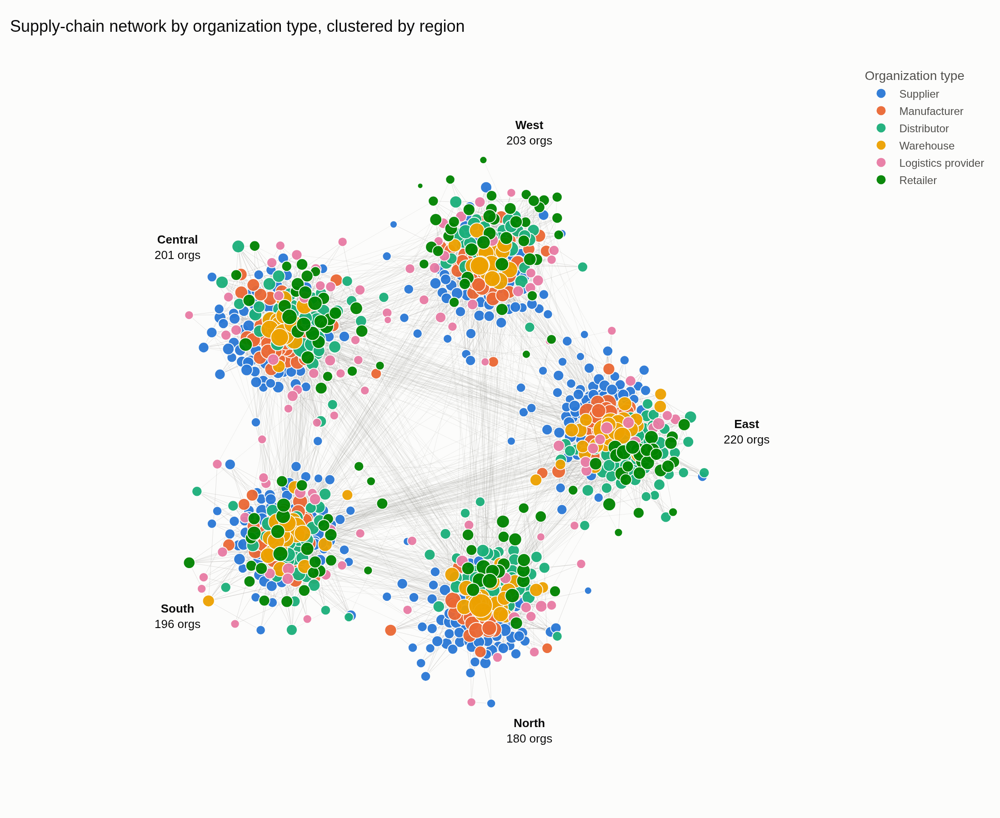

**Figure 1. The supply-chain network by organization type, clustered by region.** Each dot is an organization, sized by total degree. Organizations are grouped by region, so the dense lines inside each cluster are intra-regional relationships and the thin lines between clusters are the 11% that cross regions. Every cluster contains all six organization types, with the large warehouses (yellow) at its centre.

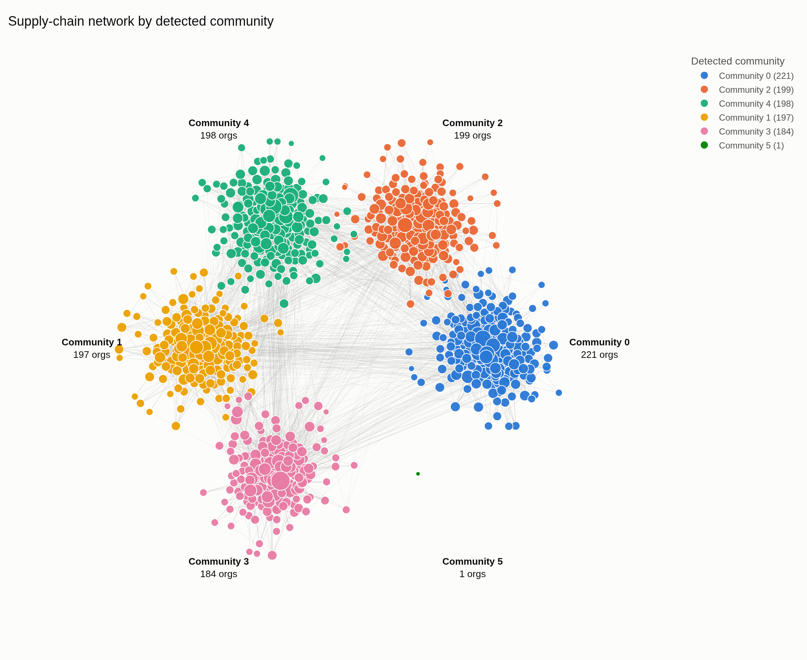

**Figure 2. The same network coloured by detected community.** The layout uses the communities Louvain found, with no knowledge of regions. The picture is nearly identical to Figure 1, which is the visual form of the ARI of 0.97. The isolated dot is the one inactive organization.

### 5.2 Analytical figures

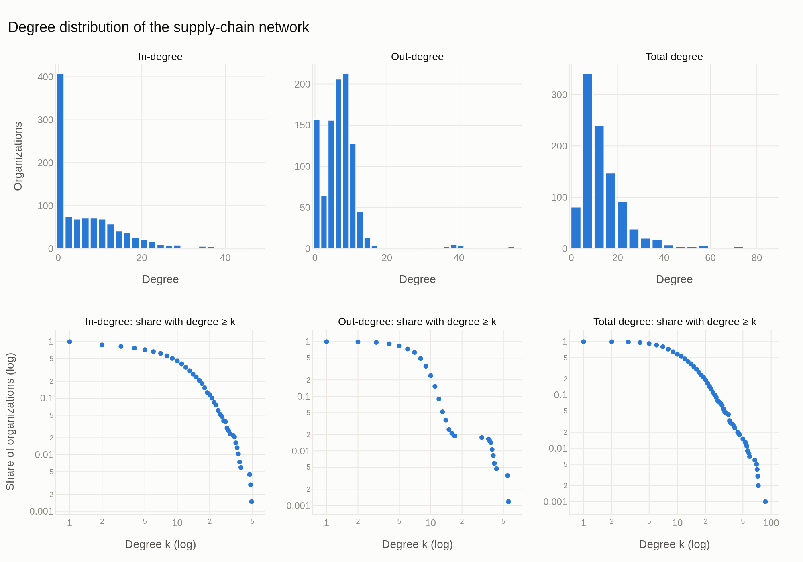

**Figure 3. Degree distribution.** Top: histograms. About 400 organizations have no incoming relationships (mostly suppliers and logistics providers). Bottom: share of organizations with degree at least k, on log-log axes. The downward bend shows a skewed but bounded distribution, not a power law.

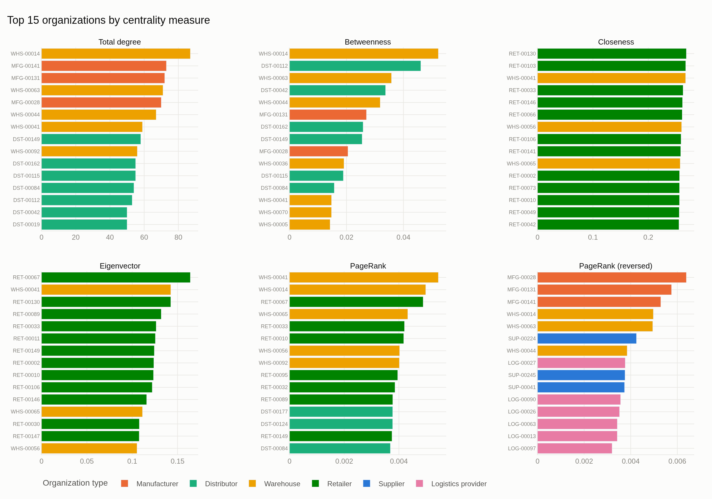

**Figure 4. Top 15 organizations under each centrality measure, coloured by type.** Each measure promotes a different part of the chain: warehouses and distributors for degree and betweenness, retailers for closeness, eigenvector and PageRank, manufacturers and logistics providers for reversed PageRank.

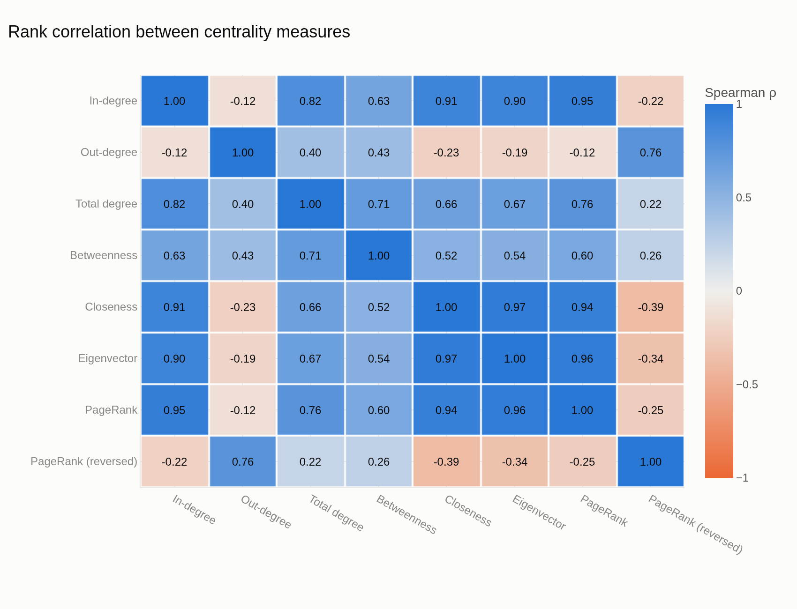

**Figure 5. Spearman rank correlation between centrality measures.** The blue block of in-degree, closeness, eigenvector and PageRank shows that these four are close to interchangeable here. Reversed PageRank and out-degree form a second group that is negatively related to the first.

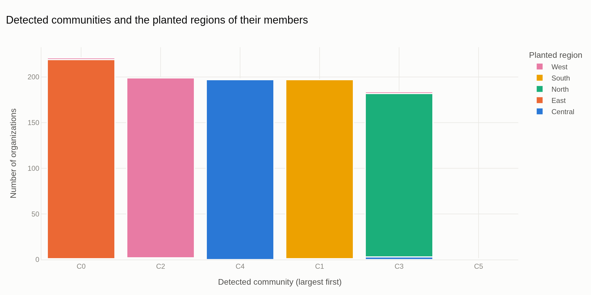

**Figure 6. Detected communities and the planted regions of their members.** Each bar is essentially one colour: each detected community corresponds to one region.

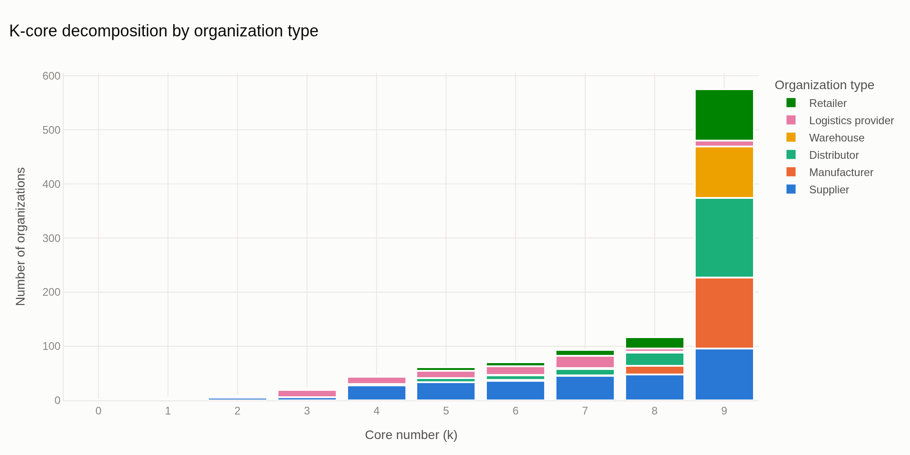

**Figure 7. K-core decomposition by organization type.** The 9-core contains over half of the network and almost all warehouses and manufacturers. Lower cores are mostly suppliers and logistics providers.

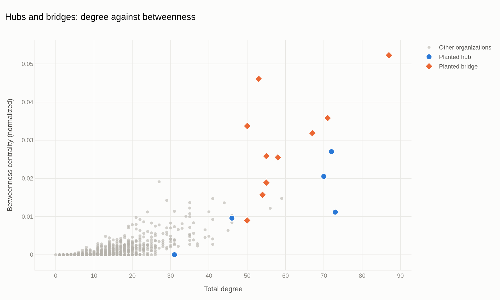

**Figure 8. Degree against betweenness, with planted hubs and bridges marked.** Bridges (orange diamonds) sit above the general trend, with more betweenness than their degree alone would predict. One hub sits on the horizontal axis: high degree, zero betweenness.

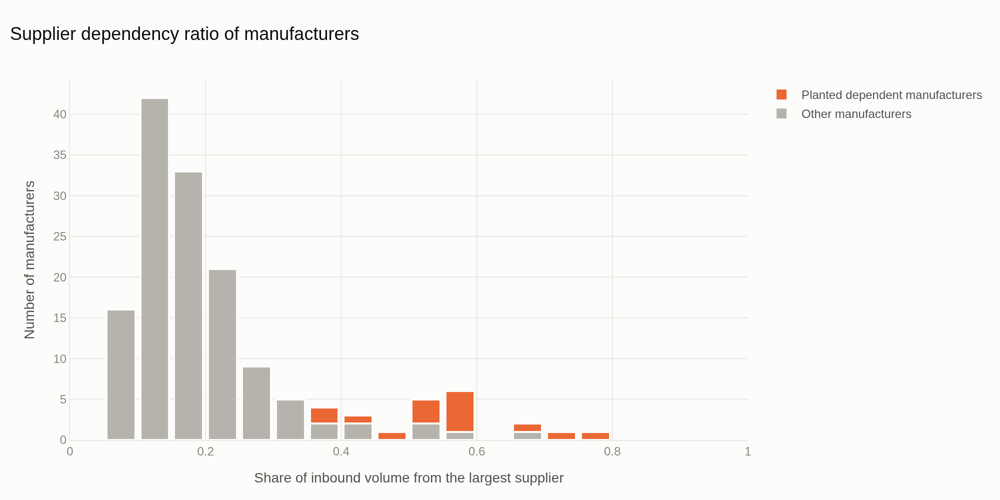

**Figure 9. Supplier dependency ratio of manufacturers.** Most manufacturers get 10–25% of their inbound volume from their largest supplier. The planted dependent manufacturers (orange) form the right tail.

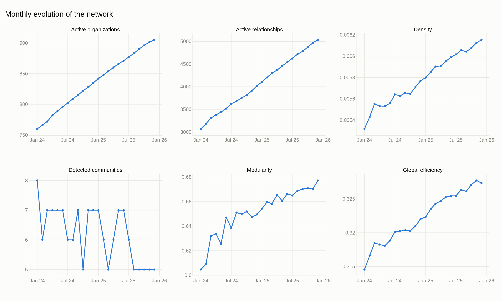

**Figure 10. Monthly evolution of the network.** Size, density, modularity and efficiency all rise; the number of detected communities settles at five.

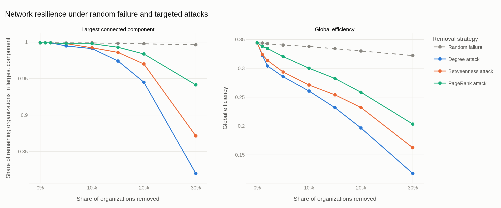

**Figure 11. Network degradation under random failure and three targeted attacks.** The random-failure line is almost flat. Efficiency (right) falls from the first removals; the largest component (left) only starts to break up after about 10%.

### 5.3 Second tool: Gephi

The graph is exported to Gephi (`python -m graph.export_gephi`) with all node attributes and NetworkX results attached. Gephi serves two purposes: a ForceAtlas 2 layout as an independent visualization, and recomputation of degree, betweenness, closeness, eigenvector centrality, PageRank and modularity for comparison. The procedure and the settings needed for a fair comparison are in `docs/gephi_guide.md`.

> **To be completed.** The export and the comparison script are written and tested, but the Gephi session itself has not been run yet. Insert here: (a) a screenshot of the ForceAtlas 2 layout coloured by region, and (b) the table produced by `python -m graph.compare_gephi`, which gives the rank correlation between Gephi's and NetworkX's value for each statistic.

An interactive Streamlit dashboard (`streamlit run dashboard/app.py`) provides the same views with filtering by organization type, region and month.

---

## 6. Discussion and Implications

### 6.1 What the network reveals

Three results would not be visible from transaction records.

**Importance has several meanings, and the default measure picks the wrong one.** PageRank is the best-known "importance" score, and on this network it ranks retailers highest and recovers none of the planted hubs. The cause is edge direction, not a flaw in the algorithm. A practitioner applying SNA to a supply chain must decide what an edge means and which way importance should flow before choosing a measure. This is the main methodological lesson of the study.

**Critical and dependent are different organizations.** Warehouses are the bottlenecks (highest betweenness, 95% in the core) and the least dependent on any one supplier. Distributors are the most dependent and hold almost all single-source positions. A risk programme aimed only at "important" organizations would protect the warehouses and overlook the distributors.

**Risk is concentrated.** Ten organizations account for as much efficiency loss as 300 random ones. This makes risk management tractable: monitoring effort can be focused on a short list.

### 6.2 Real-world implications

| Finding | Implication for a supply-chain manager |
|---|---|
| A few organizations carry most cross-regional flow | Identify them and hold contingency arrangements, such as a second route between each pair of regions |
| Distributors are frequently single-sourced | Dual-source the distributors with dependency ratio above 0.8, or hold buffer stock for them |
| Several manufacturers share one critical supplier | Audit shared suppliers across business units; this is the Aisin pattern |
| Efficiency degrades before the network disconnects | Track path length and lead time, not only whether a supplier is still reachable |
| Communities are regional | Regional shocks are contained by structure; the inter-regional bridges are where they leak through |
| Reversed PageRank finds upstream-critical organizations | Use it, alongside degree and betweenness, to rank suppliers for audits |

The same analysis could serve other parties: an insurer pricing contingent business-interruption cover, a regulator looking for single points of failure in a medicine or food supply chain, or a buyer assessing a supplier's own exposure before signing.

### 6.3 The decentralized data layer

The analysis needs complete transaction records across firms, and no single firm holds them. This is the practical case for a shared, permissioned ledger: each participant records its own transactions, and the network can be built from the ledger without any party disclosing its full books to another. The project defines the interface for such a store but implements only the file-backed version. A ledger would guarantee that records are not altered after the fact. It would not guarantee that they were true when written.

### 6.4 Limitations

- **Synthetic data.** The structures that were recovered are structures the generator created. The high recovery rates show that the methods work when such structures exist and are reasonably clean; they do not show that real supply chains contain them. Real communities are unlikely to be as well separated as modularity 0.65.
- **Design parameters drive results.** The regional preference (0.92) and the bridge and hub link counts were chosen by us. With weaker regional preference, community recovery would be lower. An earlier version of the generator, in which later relationships ignored region, gave modularity 0.25 and no usable community structure.
- **Bridges were planted with many links**, which makes them well connected as well as well placed, so the study cannot show betweenness finding a low-degree bridge.
- **One seed.** All results are from a single generated dataset. Variation across seeds was not measured.
- **Centrality is structural, not economic.** A high score says where an organization sits, not how substitutable it is, how much stock it holds or how financially sound it is.
- **Edges are equal in the path-based measures.** Betweenness and closeness ignore volume.
- **The resilience model is static.** Organizations are removed and nothing adapts. Real firms re-route and find new suppliers. Efficiency is also computed on the undirected projection, which overstates reachability in a directed chain.
- **No causation.** The temporal trends are descriptions of generated data.

### 6.5 Future work

- Apply the pipeline to real data, for example public supplier-disclosure lists or customs records.
- Repeat the experiments across many seeds and across generator settings, to report recovery rates with confidence intervals and find the point at which community detection breaks down.
- Plant low-degree bridges to test whether betweenness can separate brokerage from connectivity.
- Use directed, flow-based measures of resilience: what share of retailers can still be reached from at least one supplier.
- Model cascading failure, in which an organization fails when it loses a given share of its supply.
- Compare Louvain with Leiden and Infomap, the latter being designed for directed flow.
- Treat product categories as layers of a multilayer network.
- Predict disruption or new relationships with graph neural networks.
- Implement the ledger-backed transaction store.

---

## 7. Conclusion

This study modelled a supply chain of 1,000 organizations as a directed, weighted network and asked what its structure reveals. The answers to the six research questions are:

1. **Structural importance** depends on direction. Degree finds the best-connected organizations; standard PageRank finds where flow ends; reversed PageRank finds where supply originates and is the appropriate measure for supply risk.
2. **Bottlenecks** are the warehouses and the cross-regional distributors. Betweenness placed 9 of 10 planted bridges in its top 30.
3. **Hidden dependencies** are measurable. The analysis identified the planted critical supplier for all 15 dependent manufacturers and showed that distributors are the most exposed tier.
4. **Communities** correspond to regions and were recovered with an ARI of 0.97. The core of the network is its middle tiers.
5. **Resilience** is asymmetric: a 6% loss of efficiency after 30% random failures, against 66% after targeted ones.
6. **Over time** the network became larger, denser and more strongly clustered by region.

The contribution of the study is in three parts. First, a reproducible pipeline that goes from transactions to network to findings. Second, a ground-truth evaluation that measures how well each SNA method recovers known structure, instead of reporting scores that cannot be checked. Third, a specific and transferable caution: on a supply chain, the direction of the edges determines what a centrality measure means, and the conventional choice gives the wrong answer for risk.

For practice, the conclusion is that supply-chain risk is a property of position in a network, that the positions which matter are few and can be found, and that finding them requires the network view that transaction systems do not provide.

---

## References

Albert, R., Jeong, H., & Barabási, A.-L. (2000). Error and attack tolerance of complex networks. *Nature*, 406, 378–382.

Bastian, M., Heymann, S., & Jacomy, M. (2009). Gephi: An open source software for exploring and manipulating networks. *Proceedings of the International AAAI Conference on Web and Social Media*.

Blondel, V. D., Guillaume, J.-L., Lambiotte, R., & Lefebvre, E. (2008). Fast unfolding of communities in large networks. *Journal of Statistical Mechanics: Theory and Experiment*, P10008.

Bonacich, P. (1972). Factoring and weighting approaches to status scores and clique identification. *Journal of Mathematical Sociology*, 2(1), 113–120.

Borgatti, S. P., & Li, X. (2009). On social network analysis in a supply chain context. *Journal of Supply Chain Management*, 45(2), 5–22.

Brin, S., & Page, L. (1998). The anatomy of a large-scale hypertextual web search engine. *Computer Networks and ISDN Systems*, 30, 107–117.

Freeman, L. C. (1977). A set of measures of centrality based on betweenness. *Sociometry*, 40(1), 35–41.

Hagberg, A. A., Schult, D. A., & Swart, P. J. (2008). Exploring network structure, dynamics, and function using NetworkX. *Proceedings of the 7th Python in Science Conference*, 11–15.

Hubert, L., & Arabie, P. (1985). Comparing partitions. *Journal of Classification*, 2, 193–218.

Kim, Y., Choi, T. Y., Yan, T., & Dooley, K. (2011). Structural investigation of supply networks: A social network analysis approach. *Journal of Operations Management*, 29(3), 194–211.

Nishiguchi, T., & Beaudet, A. (1998). The Toyota group and the Aisin fire. *Sloan Management Review*, 40(1), 49–59.

Seidman, S. B. (1983). Network structure and minimum degree. *Social Networks*, 5(3), 269–287.

Wasserman, S., & Faust, K. (1994). *Social Network Analysis: Methods and Applications*. Cambridge University Press.

---

## Appendix: Reproducing the results

```bash
python3 -m venv .venv && source .venv/bin/activate
pip install -r requirements.txt
./run_pipeline.sh                  # generate → build → analyse → report
python -m graph.export_gephi       # write data/exports/supply_chain.gexf
pytest tests/                      # run the test suite
streamlit run dashboard/app.py     # interactive dashboard
```

Result files are in `reports/results/`, tables in `reports/tables/`, figures in `reports/figures/`. The methodological decisions are recorded in `BUILD_DECISIONS.md`.
